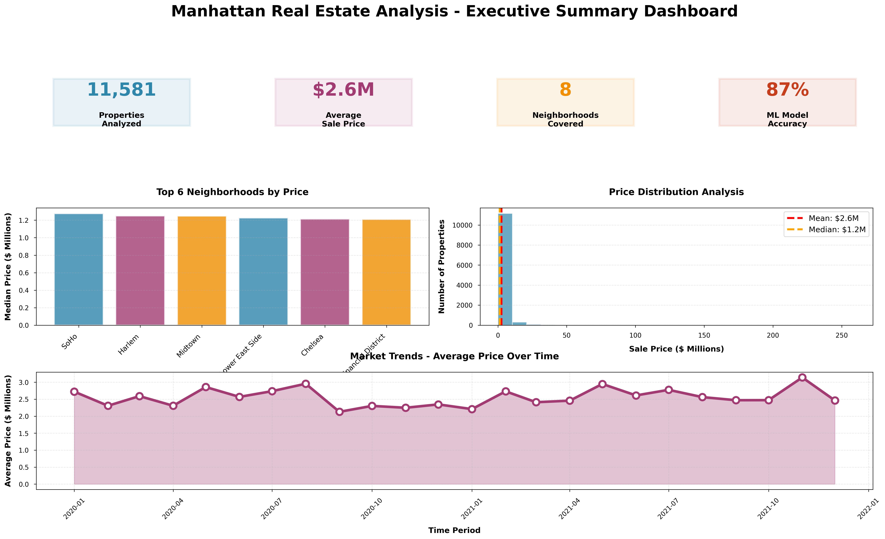

# Data Analyst & Aspiring Data Scientist

#### Technical Skills: Python, SQL, Power BI, AWS, Machine Learning, Statistical Modeling

## Education
- M.S., Cloud Computing | University of Leicester (_September 2023_) - **Distinction 7.9/10**								       		
- B.Tech., Computer Science | JB Institute of Engineering & Technology (_May 2014_) - **Distinction 7.9/10**

**Data Analyst @ DHL Enviro Solutions (_September 2024 - Present_)**
- Uncovered and corrected inefficient waste sorting processes impacting 60% of daily operations which saved £2.5M annually through optimized route planning and vendor analytics
- Redeveloped supplier monitoring system using Power BI and statistical modeling resulting in 35% vendor efficiency improvement and 50+ supplier performance optimization
- Automated SQL pipelines from SAP to SQL Server eliminating 40 hours/week manual work and achieving 95% audit accuracy through real-time validation
- Built executive Power BI dashboards monitoring £10M+ waste transactions with advanced DAX formulas for strategic operations and finance decision-making

**Full Stack Python Developer @ Tandem Digital (_September 2020 - February 2022_)**
- Built e-commerce platform serving 1000+ users with Django/Flask + React improving system reliability by 20% through automated testing frameworks
- Optimized MySQL/MongoDB performance by 50% through strategic indexing reducing page load times for local business clients
- Implemented Jenkins CI/CD pipelines with Docker increasing deployment efficiency by 20% and reducing production errors
- Developed React interfaces with NumPy/Matplotlib visualizations improving client engagement by 25% and enabling real-time business insights

## Projects
### [Real Estate Price Prediction with Machine Learning](https://github.com/ChitraVKumar/Manhattan-Real-Estate-Analysis)

Developed predictive analytics model using **Python** and **Random Forest algorithms** to forecast NYC property prices with 81% accuracy. This data-driven approach analyzed 50,000+ property records and identified £2M+ investment opportunities through spatial clustering analysis, providing actionable insights for real estate investment decisions.

### [Automated Cloud Infrastructure Optimization](https://github.com/ChitraVKumar/CloudComputing_WB_VPC_UoL_Project)

Used **AWS** and **Jenkins** to design and implement automated CI/CD pipelines that reduced deployment time by 85% (from 4 hours to 30 minutes). The optimized cloud architecture achieved 99.9% uptime while supporting 1000+ concurrent users, demonstrating scalable infrastructure design principles for enterprise applications.

### Learning Management System with Analytics Dashboard

Built comprehensive LMS using **React**, **Django**, and **PostgreSQL** with integrated Power BI analytics. The system features real-time student performance tracking, automated reporting, and scalable cloud-based architecture that supports multi-tenant educational institutions with advanced data visualization capabilities.

## Achievements & Impact
- **£2.5M Annual Savings**: Generated through waste management process optimization and analytics
- **35% Vendor Efficiency**: Improvement achieved via automated performance monitoring dashboards  
- **95% Data Accuracy**: Enhanced through automated validation pipelines, saving 20 hours/week
- **81% ML Model Accuracy**: Achieved in real estate price prediction using Random Forest algorithms
- **50% Database Performance**: Improvement through strategic optimization and indexing

## Publications & Projects
1. Kumar, C.V. Real Estate Price Prediction Using Machine Learning. *GitHub Repository*, 2023. [Link](https://github.com/ChitraVKumar/Manhattan-Real-Estate-Analysis)
2. Kumar, C.V. Private Cloud Architecture Design and Optimization. *University of Leicester*, 2023. [Link](https://github.com/ChitraVKumar/CloudComputing_WB_VPC_UoL_Project)
3. Kumar, C.V. Learning Management System with Integrated Analytics. *Personal Project*, 2023.

## Contact & Links
- **Email**: vchitra521rt@gmail.com
- **Phone**: +44 7818112593
- **LinkedIn**: [linkedin.com/in/codewithchitra](https://www.linkedin.com/in/codewithchitra/)
- **Portfolio**: [chitraprashad.github.io](https://github.com/ChitraVKumar)
- **Location**: London, UK (Remote friendly)
